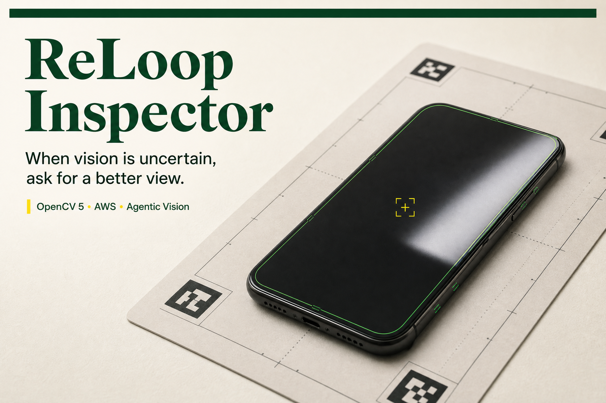
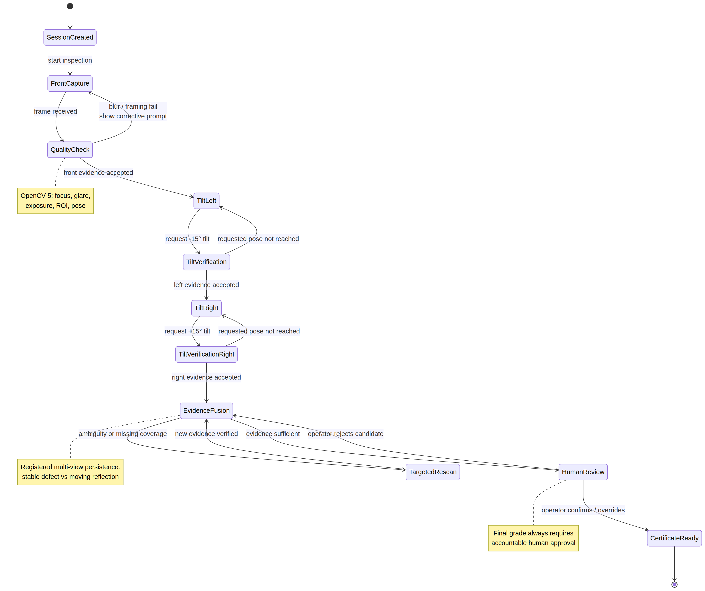
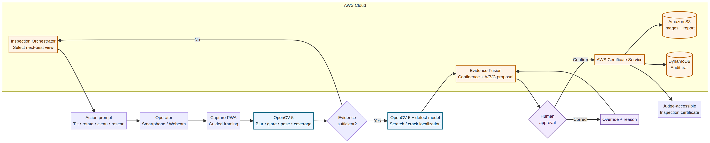

# ReLoop Inspector

> **When vision is uncertain, ask for a better view.**

ReLoop Inspector is a human-in-the-loop **Agentic Vision prototype concept** for more consistent cosmetic inspection of refurbished smartphones. Instead of forcing a grade from a weak image, the proposed workflow uses OpenCV 5 to assess evidence quality, request a reason-specific corrective view and verify the result before a human operator approves, overrides or defers the decision.

This repository accompanies **Team MERAVIGLIA’s OpenCV AI Competition 2026 submission**. It contains the product proposal, technical specification, evaluation protocol, acquisition procedure and printable capture mat.

## Why this matters

A smartphone surface can appear clean or damaged depending on focus, exposure, glare and viewing angle. ReLoop treats acquisition quality as part of the decision rather than as an invisible preprocessing detail. The central thesis is simple: **visual output should change the next action**.

## Agentic Vision workflow

The planned loop is explicit and testable:

1. **Perceive:** measure focus, exposure, glare, pose, coverage and candidate evidence.
2. **Decide:** determine whether the evidence is sufficient and which view is missing.
3. **Act:** request one specific corrective capture action.
4. **Verify:** confirm that the new frame achieved the requested change.
5. **Approve:** keep a human operator accountable for confirmation, correction or deferral.

## Technical architecture

OpenCV 5 is planned as a substantive runtime component, supporting device-region detection, perspective rectification, quality gates, glare estimation, pose verification, coverage tracking, multi-view registration and interpretable overlays. These outputs update an evidence state used by the inspection orchestrator.

The proposed AWS layer preserves consented evidence, session state, logs and a human-approved inspection certificate. AWS services and performance results described in the documentation are **implementation targets**, not claims of a completed deployment.

## Responsible scope

ReLoop supports visible cosmetic inspection only. It does not certify battery safety, water resistance, hidden functionality, authenticity, regulatory compliance or resale value. A proposed grade remains decision support; it is not an autonomous certification.

## Repository contents

| Path | Description |
|---|---|
| [`project_proposal.pdf`](project_proposal.pdf) | Full competition proposal and implementation plan |
| [`technical_specification.md`](technical_specification.md) | MVP architecture, OpenCV pipeline, interfaces and acceptance criteria |
| [`data_and_evaluation_protocol.md`](data_and_evaluation_protocol.md) | Dataset strategy, split discipline, metrics and failure analysis |
| [`capture_and_inspection_protocol.md`](capture_and_inspection_protocol.md) | Reproducible acquisition and inspection workflow |
| [`PROJECT_STATUS.md`](PROJECT_STATUS.md) | Current maturity, limitations and evidence still required |
| [`TESTING_INSTRUCTIONS.md`](TESTING_INSTRUCTIONS.md) | Judge-facing review instructions |
| [`ReLoop_Capture_Mat_A4.pdf`](ReLoop_Capture_Mat_A4.pdf) | Printable capture mat with fiducial markers |

## Current status

This is a **design and technical specification repository**, not a completed production application. It intentionally contains no simulated source code, fabricated benchmark, fake deployment trace or unsupported performance claim. The next milestone is a working OpenCV 5 prototype that demonstrates glare rejection, verified corrective capture, multi-view evidence and human review.

## Team MERAVIGLIA

**Filippo Giustini — Design Strategy.** Product framing, inspection experience, evaluation design and end-to-end narrative.

**Gaia Provvedi — Business Design.** Operator research, service model, pilot design and responsible-use validation.

## Usage and rights

The repository is public for competition review and collaboration. No reuse licence is granted unless a specific file states otherwise. Third-party datasets and software remain subject to their original licences.
